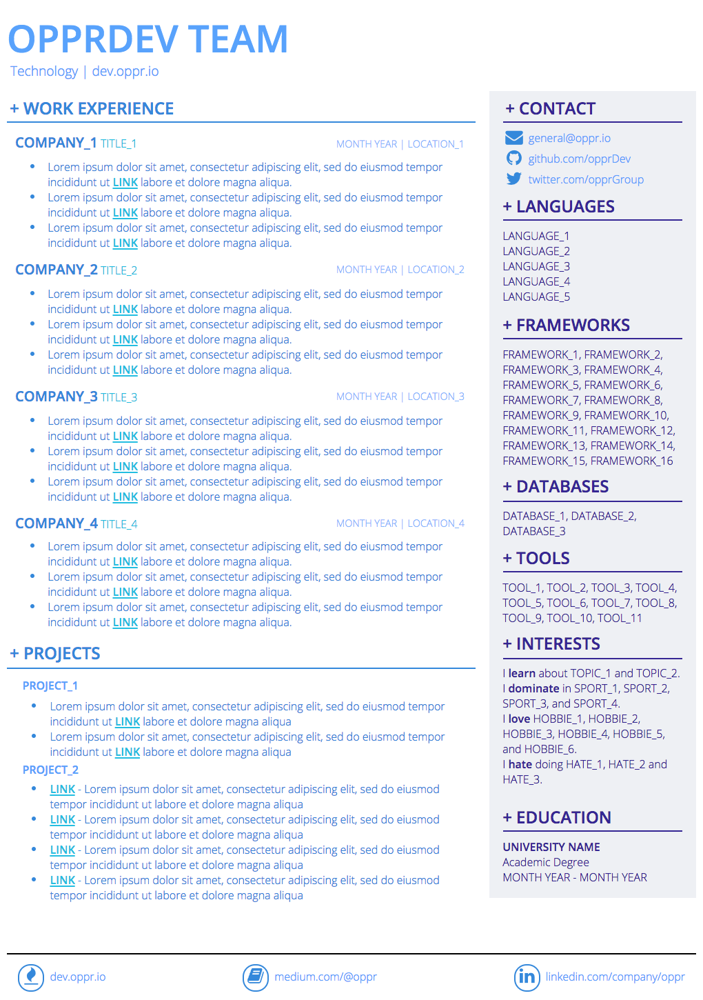

# Simple React Resume

This is [opprDev](https://github.com/opprDev) Organization Resume written in [React](https://github.com/facebook/react).

## Architecture

This resume is designed using a *component-oriented architecture*, the reason why [React](https://github.com/facebook/react) is used. However, other libraries like [Ember](https://github.com/emberjs/ember.js), [Angular](https://github.com/angular/angular.js), and [Polymer](https://github.com/Polymer/polymer) are also alternatives.


## Developing Information

This project is linted at compile-time using [ESLint](https://github.com/eslint/eslint). It is thanks to [Babel](https://github.com/babel/babel) with its [stage-0](https://babeljs.io/docs/plugins/preset-stage-0/) preset that the it compiles down to `ES5`. Nevertheless, this project also is using [webpack](https://github.com/webpack/webpack) and [react-transform](https://github.com/gaearon/react-transform).

### Clone

The simple instruction to `clone` this repository are as follows:

```BASH
> git clone git@github.com:opprDev/resume-simple-react.git
> cd resume-simple-react
```

### Install & Run

The simple instruction to `install` and `run` are as follows:

```BASH
> npm install
> npm start
```

## About



### Authors

* [Francisco Maria Calisto](http://franciscocalisto.me/) ([FMCalisto](https://github.com/FMCalisto))
